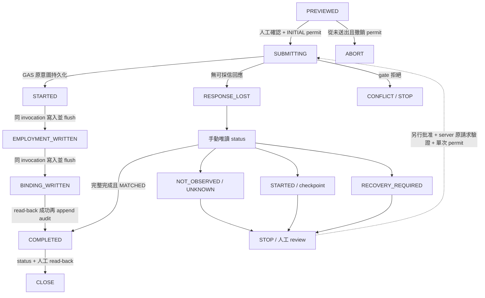

# T4 Controlled Migration Specification（人工 review 草案）

日期：2026-09-24。此文件定義待實作安全契約，**不是現有程式已具備的能力，也不是 Production Migration 授權**。

結論：**READY TO IMPLEMENT T4 SAFETY CHANGES**。可作為下一批離線安全實作的規格基礎；本輪只寫文件。Production Migration、commit/push/PR/merge/deploy 仍 HOLD。

## 0. 範圍、版本與重新核對

沿用 [T3 closure / T4 readiness](transport-v2-t3-closure-t4-readiness.md) 的證據索引 R/U/D/I/A/M/S/B/F（含固定 commit 連結）。本輪重新讀實際 source/tests，沒有重新執行 migration mock 或 production request；上一輪測試通過數不能冒稱本輪重跑。

- 本地 Transport/doc worktree：`codex/transport-redirect-diagnostics`，HEAD `c41c2564fc4352ca6a842402903a705bd9025251`。上一輪確認其 tree 與 PR #10 main merge `b92f9f91eea65b6064ae0e10c54c93db1e5f9dc5` 相同；本輪未 fetch、切 branch 或查平台。
- GAS/test 受查版本：`feature/employee-identity-v1`，HEAD `c1c9d30a21cba7a0cd700f61a93e1e6b4beab3fd`；不把此 checkout 的 GAS 當成 main 已有內容。
- T3 Production Read-Only=PASS（人工提供證據）；T4 真實 Migration=NOT READY。
- 已部署 V44 與受查 GAS 逐檔一致性仍 **NOT VERIFIED**。本輪未讀 live GAS；唯讀成功不能補足此證據。
- redirect incident 仍為 OBSERVED / NOT REPRODUCED / MONITOR，不放寬 redirect 政策、不宣稱根因已解決。

| 重新核對事項 | 實際 code/test evidence | 結論／精確化 |
| --- | --- | --- |
| EMP001 write gate | R routes 僅三個唯讀 actions；B2 employeeBaselineId_ 允許一般員工 ID；F648 明確以 EMP009 成功 | 缺口成立。Worker 不開寫入不等於 GAS direct /exec 無寫入能力。 |
| response-lost workflow | U 只可產生 status-probe ID，沒有 migration builder、原寫入資料保存或 submit state machine | 缺口成立；已有 status 唯讀能力，不是「完全沒有查詢」。 |
| migration concurrency | F680 sequential failures/replay；F794 status-vs-write；F404 approval concurrency | 缺專屬 migration-vs-migration 測試，不可用別的 module concurrency 抵算。 |
| partial recovery | B85–93、103–108 同原 actor/request/hash 可補缺 checkpoint | 有續作能力；不是 background repair，但重送本身可寫。無 rollback。 |
| snapshot | B9–18、110；F668 | 完整 state 內容 hash，沒有 TTL 或「已看過預覽」憑證；涵蓋目標 A:L，但未一般性包含另一位操作者全部資料。 |
| unknown keys | F648 用額外 role/lineUid/hireDate/salaryAmount，現有 migration 忽略其值 | 不信任額外資料是對的，但不是 strict allowlist。T4 必須明確拒絕額外 keys。 |
| completed replay | B105–106 僅 Decode；B170 起 status 則驗證完整回執與 current state | 缺口成立。不能把既有 replay success 當成目前一致。 |

既有 read-only tests 明確要求 migration 被所有 T3 routes 拒絕。未來只能為**新且明確開啟的 T4 route**增加成功案例，不得把舊 read routes 改成可寫。

## A. Controlled Migration API Contract

### A1. 唯一操作範圍

- 唯一 business action：`employeeLifecycleBaselineMigrate`。
- 唯一目標：字串精確等於 `EMP001`；不 trim 成允許值、不接受 array、alternate ID 或 target 欄位。
- Actor：每次 LINE server-side verify 得到 identity，resolve 為 ACTIVE_EMPLOYEE 且 OWNER/ADMIN；SITE_MANAGER/EMPLOYEE/其他狀態拒絕。沿用 ADMIN 不可管理 OWNER 的目標限制。
- 操作者可以是已授權的 OWNER 或 ADMIN，不新增「必须是 OWNER」、雙人審核或只能本人處理等商業規則。每次 run 只綁定其中一位實際 actor；不同 actor 不可接管原 requestId。
- 只建立 Legacy Baseline 的任職、LINE binding 與 audit。不得修改員工主檔 A:L，不准補 hireDate、改薪資/權限、重綁、suspend/leave/resume/terminate、rehire、payroll、bulk。
- 唯一**核准使用的操作流程**為專用 T4 隔離 UI → 新 route → GAS。這不是聲稱別人技術上不能 POST /exec：GAS 對 direct /exec 也必須套相同 EMP001、actor、operation permit、snapshot/checkpoint gate。CORS/隱藏按鈕不是安全邊界；V1 不另引入 Worker 專用 token 或改 LINE trust model。

### A2. Endpoint 與精確 request keys（提案，尚未存在）

- 新 Worker pathname：`/employee-baseline-migrate`，位於既有 Worker origin；不新增主機、不更換 GAS /exec URL。不得與 `/employee-read`、`/employee-operation-status` 混用。
- Browser → Worker：POST，`Content-Type: text/plain;charset=utf-8`，JSON body；fetch `redirect:"follow"` 沿用瀏覽器模式。
- Worker → GAS：保持現有手動 redirect 驗證、20 秒 deadline、body limits；POST 後僅合法 302/303 且嚴格 allowlist 才改 GET；GET 不攜 token/body/cookies；不 retry/fallback。Worker timeout 不能取消已在 GAS 執行的寫入。
- Worker 與 GAS 均要求 plain object、精確七個必填 keys，缺少/額外欄位拒絕。不接受 frontend 的 actor/role/userId/hash/permission/recoveryAllowed 等聲明。

| Key | 契約 |
| --- | --- |
| action | 精確 `employeeLifecycleBaselineMigrate` |
| idToken | 當次 LIFF ID token；僅記憶體／傳輸，server-side verify；不加入操作 hash、永久 storage 或 audit |
| employeeId | 精確 `EMP001` |
| requestId | client `t4-baseline-` + crypto.randomUUID()；server regex 沿用 `[A-Za-z0-9_-]{16,100}`；拒絕 status-probe prefix |
| expectedSnapshotVersion | 原 dry-run snapshotVersion，64 小寫 hex；不得換成 recovery 時的新 snapshot |
| reason | 非空白 string，原長度 ≤1000；trim 一次成固定 canonical reason；不得含 token/UID/憑證 |
| confirmed | boolean `true`；不能單靠此 flag 視為 server approval |

requestHash 保留現有 canonical algorithm：SHA-256(JSON array of `LEGACY_BASELINE`, verified sub, verified channelId, EMP001, expectedSnapshotVersion, canonical reason, true)。requestId 是操作識別，不是 hash 內容；token refresh 不改 requestHash。client 不計算或傳入 requestHash。

### A3. Response 與錯誤

成功回應至少含既有 `success/employeeId/baselineState/version/recoveryStatus`，**建議新增必需的 requestId echo** 供 T4 client 對應原操作（新欄位，須補契約測試）。client 不以 HTTP 200 或 `success=true` 單獨 CLOSE。

本次首次成功預期 `RECORDED`、version=1、recoveryStatus=COMPLETED。收到 ALREADY_BASELINED 不能當作本次完成，轉人工檢查，不新增 audit 或覆蓋。

完成後仍用既有 `employeeLifecycleBaselineRequestStatus`（EMP001 + 原 requestId）確認 `COMPLETED / historicalCompletion=true / MATCHED`；兩個 Allowed 永遠 false。未知 shape、target/ID 不符與非 JSON 一律結果未確認，非「可重試」。

原有安全 code 沿用；T4 新 gate 最小新增固定 code 建議：`CONTROLLED_MIGRATION_DENIED`（未放行／permit 不符）、`RECOVERY_APPROVAL_REQUIRED`（需人工原請求續作批准）。VERSION_CONFLICT/REQUEST_CONFLICT/FORBIDDEN/RECOVERY_REQUIRED/BUSY 保持安全訊息，不能回傳 grant、raw exception、hash 或上游 body。各 code 都不能讓 client 自動重送。

### A4. Server operation permit（待實作的技術放行，不是新商業角色）

決策：**C. GAS server authoritative + D. manual administrator workflow**。client 只能提出已確認內容；Worker 只限制 route/schema/target，不能授予 recovery。

為避免「直接 /exec」「換 ID」「雙 tab」繞過首次 ONE WRITE，最小方案是 GAS 私有 Script Properties 中一份固定 EMP001 控制紀錄（建議名稱 `T4_EMP001_BASELINE_CONTROL`）。缺少、損壞、關閉或不匹配均拒絕；不能由 migration/status API 或 browser 寫此紀錄。

紀錄必要內容：formatVersion、EMP001、原 requestId、預定 actor employeeId、server 算出的 requestHash、expectedSnapshotVersion、actor role at approval、initialApprovalReference、批准者/時間、mode（INITIAL/RECOVER_ORIGINAL）、permit generation、ARMED/CLAIMED/CLOSED、claim 時間及小型追加歷程。不保存 token、不對 browser 回傳；hash/操作原因等只留私有維運證據。

- 放行由 OWNER/ADMIN 明確人工批准；專案維護者依批准透過**未暴露為 API 的 editor-only helper**準備/關閉 permit。這是未來設計，不在本輪執行，也不是泛用 recovery API。helper 從 server 員工/binding/config 解析預定 actor，計算 requestHash，不讓人工輸入 LINE UID 或貼 token。
- 人工批准 reference 與維護者執行紀錄必須保留。editor helper 本身不是 LINE 驗證的管理员審核 API；不可把其輸入的批准者 ID 宣稱為已經 LINE 認證。其信任邊界是有權修改 GAS code/properties 的部署維護者，business API 仍重新驗證真正呼叫者。此輪不新增雙人批准規則。
- helper 與 write 都使用同 ScriptLock。每份 permit 精確匹配同 actor、request/hash、EMP001、snapshot；role/綁定改變失效。ARMED 必須先寫成 CLAIMED 並讀回成功，才可寫第一個 business/audit checkpoint；失敗則禁止向下執行。
- Properties 與 Sheets **不是 transaction**；CLAIMED 成功但 STARTED 尚未寫就中斷，是合法的不明狀態。不得自動 re-arm；人工查核後可對**同 ID**重新批准一代 permit，保留上一代歷程。
- CLAIMED 不授權第二次寫入。第一次 invocation 可在同鎖內完成整條流程；另一 invocation 等鎖後看到 partial 必須拒絕續作，除非有另行 ARMED 的 RECOVER_ORIGINAL generation。完整且嚴格驗證的原 completed replay 可純讀回傳，無須再次消耗寫入 permit。
- 有效 COMPLETED 的纯讀 replay 也要核對原 operatorSub **及 operatorId**、channel、ID/hash和完整回執，不能只沿用現有 operatorSub 查詢；未有有效完成證據時絕不以 replay 為名越過 permit。token 未過期於最初 verify 不代表等待鎖後的 actor 權限仍有效，鎖內重查不能省略。
- 更換 actor、requestId 或內容不能重新開門；先前 unresolved 操作不得被新 permit 蓋掉。任何 helper/property 故障 fail closed。server 只承諾合作鎖下的一次受控嘗試，不聲稱網路 exactly-once。
- 紀錄為權限受控、邏輯追加證據，不是不可竄改儲存。關閉時保存核准與 claim 歷程，不直接清空整份控制紀錄。
- 私有 control ledger 只服務此一首例，容量不足／歷程無法保存時停止，不自動裁切舊 approval/claim；不把 Script Properties 宣稱為長期 HR audit 資料庫。

## B. RequestId Decision Table

### B1. 產生、固定、保存與丟棄

dry-run 成功後，管理員選定原因／確認內容；client 產生 ID **一次**，在 final confirmation 前固定 target、snapshot、canonical reason、actor。同一操作只允許重新取得短效 token，不可更動 business fields。

送出前先把最小 journal 寫入並讀回：requestId、EMP001、action、`attemptMayHaveStarted`、本地狀態；**在呼叫 fetch 前**把 attemptMayHaveStarted 設 true。最小 journal 可用此隔離頁 namespaced localStorage，確保頁面重開可找到原 ID；不存 token、UID、snapshot hash、requestHash、reason、薪資、原 body/response。它不是授權依據。若 storage 不可用、journal 損壞或已有 unresolved entry，禁止新寫入。

完整非 token canonical payload 只在 tab memory 與私人人工 run record / server permit 中保存，不能放公開 repo/URL/log。refresh 後預設 **status-read only**；同一 actor 重驗後查原 ID。localStorage 被清除不代表 server 未執行；permit 仍擋新操作。若原 ID 遺失，人工从私有 run record 找回，禁止猜／產生 replacement ID。

未呼叫 fetch、permit 未 CLAIMED 且人工已撤銷 ARMED permit 時可 ABORT，清除草稿並作廢未使用 ID。送出之後 ID 不丟棄、不重用於另一操作；只有 CLOSE 並將證據保存到私有 run record 後可清除本機 journal。logout 清 token/identity，不得讓 unresolved journal 變成可建立新操作。

「證明沒有開始」不能只靠 NOT_OBSERVED。若要終止已可能送出的計畫，維護者必須在同 ScriptLock 內撤銷原 permit，核對 claim/原 audit/business rows，阻擋尚未到達或仍在 LINE verify 的遲到原 POST；放鎖後遲到 POST 必須因 permit 已撤銷而拒絕。有 CLAIMED 或其他不明證據就保留原 ID，交人工處理，不換 ID。

| 情境 | requestId | 寫入權 | 允許的動作／決策 |
| --- | --- | --- | --- |
| PREVIEWED，尚未送出 | 新產生一次後固定 | 尚無 | final confirmation + server INITIAL permit；不滿足則 ABORT |
| final confirm 改內容，從未送出 | 先撤銷原 permit/作廢 ID；重新 dry-run 可建新草稿 | 尚無 | 必須證明 attempt 未開始；不是 timeout replacement |
| 第一次 submit | 使用固定原 ID | 只一次 | ARMED → CLAIMED；client fetch 一次，鎖所有 write controls |
| timeout/network/response lost | 保留原 ID | 禁止 | 記為 RESPONSE_LOST，手動 status-read；不產生新 ID |
| status UNKNOWN／status 本身失敗 | 保留原 ID | 禁止 | 可由人再按唯讀查詢；不自動 polling 或 fallback |
| status NOT_OBSERVED | 保留原 ID | 禁止 | 看不到原 actor 回執≠未寫。查 permit、actor與執行是否已停止；人工 review |
| status STARTED（任何 consistency） | 保留原 ID | 預設禁止 | 人工確認 exact checkpoint 後才可能批准 RECOVER_ORIGINAL；不改 snapshot/reason |
| status COMPLETED/MATCHED | 原 ID 關聯結案 | 禁止 | read-back + audit/binding checks；完成 CLOSE |
| RECOVERY_REQUIRED | 保留原 ID | 禁止 | 人工分析矛盾；不直接給普通 recovery permit，不刪列 |
| VERSION_CONFLICT／REQUEST_CONFLICT | 保留原 ID 與原內容 | 禁止 | 原操作 CONFLICT；查明已否觀察。只有證明从未開始且撤銷 permit 才能另行批准新計畫 |
| BUSY/permission denied/parse error 回應 | 保留原 ID | 禁止 | 此回應只描述該 invocation，不能排除另一個同 ID invocation；status/manual review |
| 已批准原請求續作 | **同一原 ID、同一 hash/payload** | 一次 | 新 permit generation，但不產生新 business ID；人工明確再確認一次 |
| CLOSE | 保留私人封存 reference；本機可人工清除 | 禁止 | 不提供「再建立基線」；無替代 ID |

## C. Migration State Machine

### C1. 三種狀態分層

| 狀態 | 所屬層 | 意義 |
| --- | --- | --- |
| PREVIEWED | Client interpretation | 已讀預覽，還沒有 server 寫入；不是授權 |
| SUBMITTING | Client interpretation | 已固定 journal 並發出唯一 write；不能判定 GAS 到哪一步 |
| STARTED | Audit/checkpoint | 原意圖 audit 存在且驗證有效；business rows 可仍不存在 |
| EMPLOYMENT_WRITTEN | Business checkpoint | 有一筆 exact employment image；無 binding |
| BINDING_WRITTEN | Business checkpoint | employment + binding 均 exact，尚無 COMPLETED audit |
| COMPLETED | Audit/checkpoint | 驗證完成回執 + 兩筆 business rows；UI 尚須 runbook read-back 才 CLOSE |
| RESPONSE_LOST | Client interpretation | 未收到可採信回應；server 可能是任一 checkpoint 或根本未開始 |
| UNKNOWN | Status interpretation | 此次查詢無法判定，不是 server business state |
| RECOVERY_REQUIRED | Evidence classification | 回執/資料矛盾、無法證明可接續；不是「允許修復」 |
| CONFLICT | Client/error classification | input hash/snapshot/permission 等 gate 不符；保留原操作待核對 |

employment/binding 沒有這些名字的 stage 欄位；其存在與 image 驗證才是 checkpoint。沒有假想的資料庫 transaction 狀態欄。

虛線不是自動 transition；矛盾狀態不可直接續作，須先獨立審查解決原因而不改歷史證據。server checkpoint 可以在 UI RESPONSE_LOST 時繼續前進，直到 GAS invocation 結束；UI abort/Worker timeout 不提供取消保障。

禁止：UNKNOWN/NOT_OBSERVED → 自動新 request；STARTED → 無批准重送；binding-only → 補 employment；COMPLETED → 新 migration；RECOVERY_REQUIRED → 刪列重來；CONFLICT → 換 snapshot 沿用舊 ID；任一 unresolved → 清 journal 當未操作；任何狀態由 client `Allowed=true` 授權。

## D. Partial Write Recovery Contract / Authority

| 中斷點 | 偵測與 status | 同 ID 續作 | 人工／client／audit |
| --- | --- | --- | --- |
| A STARTED 後，尚無兩筆 row | 一組有效 intent，原 snapshot 可重建；STARTED/false/ABSENT | 可列入批准候選；另有 RECOVER_ORIGINAL permit 才可補兩筆 | client 只查詢；保留原 STARTED，不另造 intent；同 afterJson IDs/images |
| B employment 有、binding 無 | exact employment，原 snapshot 可重建；STARTED/false/PARTIAL | 只可補原 binding，再 read-back/COMPLETED | 另行人工批准；不改已有 employment、不換 ID |
| C 兩筆有、COMPLETED 無 | 兩筆 exact；STARTED/false/MATCHED | 只可補原 COMPLETED audit | 另行人工批准；不是重做 business writes |
| D COMPLETED 有但 response lost | valid STARTED+COMPLETED、兩筆 exact；COMPLETED/true/MATCHED | **不需也不允許寫入 recovery** | status/read-back 後結案；若 client 重送，最多嚴格驗證後純讀回執，0 writes |
| binding 有、employment 無 | inspect 不合法；RECOVERY_REQUIRED/false/CONFLICT（有損毀回執則 historical 可為 null） | 不可一般續作 | 人工另案，不刪 binding、不補造 employment |
| 有 completed 但資料變動 | RECOVERY_REQUIRED，historical 可 true/null，CONFLICT | 不可一般續作 | 先區分合法後續 lifecycle 與損毀，不還原舊值 |

成功的 status 本身永遠 `recoveryAllowed=false/newRequestAllowed=false`，不新增會回 true 的 status 分支。人工批准不是 client 的 `confirmed:true`，也不是 Worker 的 route 放行。

GAS 每次續作須再驗 LINE、原 actor employeeId + sub/channel、role/state、原 request/hash、permit、完整 STARTED、原 image、原 snapshot（僅移除本操作可證明 checkpoint）與 target gate。原 actor 已停權/離职/重綁、資料漂移、任意 row 多出/缺漏／內容不符均停止。不能由另一位 OWNER 直接接管同 ID；若需要接管是下一個獨立規格，不在 T4 V1。

不是「人工同意就跳過檢查」：人工批准 + server 精確驗證兩者缺一不可。長時間未知也不構成批准。

## E. Concurrency Contract

server write 採現有 **ScriptLock / tryLock(5000)**。LINE UrlFetch 在鎖外；鎖取得後依序：重讀 actor 身分/binding/在職/role → 精確 target/key gate → 讀 permit → 讀 target A:L、重複 identity、employment/bindings、相關 audit → compute requestHash → 驗原 receipt → initial 時比 current snapshot，recovery 時重建原 snapshot → consume/read-back permit → checkpoint writes/read-back/audit → finally flush/release。

所有新 helper（包括 permit prepare/claim/close）使用同 lock；read-only status 保持獨立 tryLock(1000)，busy 回 UNKNOWN，不 flush。不持鎖等待 LINE或人工核准。人工 Sheets 編輯與外部程式不受 ScriptLock 約束；首次 run 的維運 precheck 必須暫停這些人工改動，不可宣稱鎖能封住所有 writer。

| 競爭情境 | 決定性結果 |
| --- | --- |
| 同 actor double click | UI 同步 busy + journal 防第二次 fetch；server 仍為最終保護 |
| 同 ID 同 payload 同時送 | 一個取得 lock/consume permit；另一個 BUSY，或等到完成後純讀回執；若 partial 必須 RECOVERY_APPROVAL_REQUIRED，不能藉排隊重送續作 |
| 同 ID 不同 payload | hash 不同 REQUEST_CONFLICT/permit mismatch，0 新寫入；不能另取新 ID 繞過 |
| 不同 ID 同時 EMP001 | 只有綁定 permit 的原 ID可寫；另一個被拒，不自動合併、不建第二組基線 |
| OWNER/ADMIN 同時 EMP001 | 不以高角色搶占；只有已綁定 actor/request 的 run 被允許；兩者都仍須符合角色規則 |
| preview 後 target 資料/grade/薪資/role/status/UID/binding 改變 | target authorization 先 fail 或 snapshot VERSION_CONFLICT；首次 STARTED 前不得寫 |
| actor role/state/binding 在 LINE verify 後改變 | 鎖內 re-resolve 並核對 permit actor/role；不沿用 client/bootstrap 舊權限；不符即拒絕 |
| manual Sheet edit 恰好在 critical section | 無原子保證；read-back/inspect 必須保守 RECOVERY_REQUIRED；停止，不自動修復 |

所有關鍵讀取在鎖內再次執行；首次 preview 的結果僅作預期值，不是最新授權。grant CLAIMED、STARTED、business rows、COMPLETED 各有獨立失敗點。

## F. Snapshot Contract

现有 snapshotVersion = SHA-256(JSON.stringify(['LEGACY_BASELINE_SNAPSHOT_V1', state]))，state 由 B9–18 建立；排序用 serialized row；主檔日期 H/I 使用既有 Asia/Taipei yyyy-MM-dd normalization。不在本規格偷偷改 hash algorithm。

| 保證項目 | 實際涵蓋 | GAP / 限制 |
| --- | --- | --- |
| employee identity | 目標 A(employeeId)、B(legacy LINE UID)、C(name)，完整 A:L；same ID/UID identityRows | 不等於這次已驗證目標本人的 token（actor≠target 時） |
| grade/salaryType/salaryAmount/role | D/E/F/G 原值；數字與字串型別也影響 hash | 真實不可算薪資仍由 eligibility 擋；不自動正規化金額 |
| hireDate/endDate/status | H/I/J；未知 H 保持空白 | 無時間 TTL；不代表永遠在職 |
| LINE bindings | employeeId=target 或 lineSub=target legacy UID 的全部 rows | 若 actor 是另一人，其獨立 binding 未一般性包含；由鎖內 actor resolve + permit requestHash/role 另守 |
| employment | 目標全部任職 rows | 不是只看目前 active row |
| audit | target employeeId 或 operatorSub=target UID 的 rows | 某些 actor audit 即使非本 target 也會使 snapshot 變動；保守 false conflict 可接受，不放寬 |
| channel / duplicates | channelId、相同 ID/UID 的主檔 rows | 不涵蓋未相干全公司資料；不是全庫 transaction hash |

上述目標業務欄位 **沒有 hash 覆蓋缺口**；actor 狀態/角色/綁定與 permit approval 的一致性是額外 gate，不應誤稱 snapshot 已涵蓋。資料未變時單純時間流逝不使 hash 失效；T4 每個新 run 一定重新 dry-run、核准，不自行設定未批准的 business TTL。

Recovery 不得以新 snapshot 取代原 snapshot。必須從當前 state 移除且僅移除本 request 被證明正確的 rows/audit 後，重建最初 hash；無法證明即 STOP。

## G. Response-Lost UX Contract

fetch 一旦可能送出，無論 HTTP code、redirect failure、timeout、JSON parse failure、malformed success、頁面 reload 都不宣稱「完全沒寫」。journal 先於 fetch，callback/timeout 不能把 state 重設回可 submit。

| 結果 | 固定 UI wording | 允許操作 |
| --- | --- | --- |
| HTTP + schema success、原 ID 相符 | 「已收到處理回覆，尚待查詢原請求與人工核對；請勿再次送出。」 | 手動 status-read；不直接 CLOSE |
| timeout/network/無可採信回應 | 「結果尚未確認，後端可能已完成或部分完成。請保留原操作編號，僅查詢狀態，勿再次送出。」 | 重新驗證身分、原 ID唯讀查詢、聯絡管理員 |
| COMPLETED/true/MATCHED | 「原請求已完成且目前資料相符。請完成唯讀核對後結案，不需再次寫入。」 | runbook VERIFY；不提供寫入 |
| STARTED | 「原請求已有開始紀錄，尚未完成結案。停止寫入，等待人工核對。」 | 原 ID唯讀查詢/人工 review |
| NOT_OBSERVED | 「尚無此登入者可見的原請求證據；不代表未寫入，不允許建立新請求。」 | 核對同 actor/原 ID；人工檢查 permit/執行狀態 |
| UNKNOWN | 「目前無法確認原請求，請勿重送或更換操作編號。」 | 手動再次唯讀查詢；不 polling |
| RECOVERY_REQUIRED | 「資料或回執需要人工核對；本頁不會修復或重送。」 | STOP + evidence + manual review |
| CONFLICT/FORBIDDEN/BUSY | 「本次操作未獲確認。保留原操作編號，停止寫入並查核。」 | 不把 error 字樣當未寫證明 |

收到不合法 status 組合或 Allowed=true 必須拒絕呈現為可寫。UI 不 render raw server message/JSON，只 render allowlisted fields/code 與固定文字；技術測試可顯示 EMP001/原 requestId，不能顯示 sub/token/hash/audit/private URLs。

本規格不要求任何自動 network action。submit 完成、失敗或 reload 後，status 必須人工按按鈕；不新增 polling、retry/fallback。若人工批准 recovery，專用明確確認不是一般「重試」按鈕，且 server permit 必須一致。

## H. Audit Contract

四張表欄序保持原契約；本操作不使用 application，不改主檔。本段是待實作 audit 安全增補，不能直接套入既有 v3 parser。

| 欄位 | 分類 | 契約 |
| --- | --- | --- |
| auditId | 必要 | 每個 audit row 唯一；STARTED/COMPLETED 不同 |
| requestId / requestHash | 必要 | 原操作 ID + canonical hash；永不以新 ID掩蓋中斷 |
| employeeId / employmentId | 必要 | EMP001 與本 intent 產生的固定任職ID |
| operatorSub / operatorId | 必要 | 僅 verified actor 的後端受保護證據；不回前端／公開 log |
| applicationId | 必要 | Legacy baseline 為空；不偽造加入申請 |
| action | 必要 | LEGACY_BASELINE |
| effectiveDate/effectiveAt | 必要 | 原開始時 server 日期/時間；續作不改成新任職起日 |
| beforeJson | 必要 | baseline 前必要主檔 A:L 的正規化 private snapshot；未知欄位原值保存，不猜歷史；現有 v3 只有 state label，需增補 |
| afterJson | 必要 | 原 employment/binding exact image、snapshotVersion、source、固定 approval/run reference；保留未知 hireDate 警告語意 |
| reason / operatedAt / phase | 必要 | 人工原因、server時間、STARTED/COMPLETED；不把 transport fail 當完成 |
| beforeVersion / afterVersion | 必要 | 0→1 是 baseline version；STARTED 的 afterVersion 是計畫，不是完成證據 |
| source / snapshotVersion | 必要 | LEGACY_BASELINE + T4 controlled source；snapshotVersion 保留原值、只在受保護資料保存 |
| original requestId / recovery linkage | 必要（有續作時） | 原 ID就是 original，不加 replacement；approval/permit generation 私有 ledger 必須可連回同 ID/hash與原 audit |
| transport version | 建議 | 放私人 run record 及可驗證部署版本；client 傳來的版本不能作授權或 audit 真相 |
| LINE token / raw token response / raw body / secret / Location / stack | 不應保存 | 也不得 hash token；audit 不用完整 HTTP request 作 before/after |

### H1. 最小版本化策略

建議只對新 T4 baseline 使用 JSON `format:4`：beforeJson 有 baselineState + normalized master A:L；afterJson 保留 employment/binding/snapshotVersion，加受控 source、initialApprovalReference、固定 warning codes（HIRE_DATE_UNKNOWN）。不新增 Sheet 欄、不複製全部歷史 audit 或任意 token response。

現有 status 嚴格要求 format3 的 beforeJson，不能只加欄位就上線；decode/status/replay 必須一起加入嚴格的 v4 schema，保留 format3 的既有唯讀驗證與 fixtures。未經另案審查，不對既存 format3 partial intent 開放 T4 recovery。現有 v3 completed/history 不 rewrite。

STARTED 與 COMPLETED 的 business/evidence image 必須相同，僅 auditId/phase/operatedAt 可不同。read-back 後才能 append COMPLETED；不能為了回成功補假 audit。

recovery 批准/claim 歷程保存在 A4 的私有 control ledger，含原 ID/hash、generation、approvalReference、批准者／維護者／server claim 時間；不用隨意插新 phase 破壞現有只允許 STARTED/COMPLETED 的 receipt parser。首次 run 結案連同人工批准紀錄封存，不能只留最後一個可覆寫 permit。這是邏輯 traceability，不是防管理者竄改證明，不宣稱 ISO 認證。

完整 completed replay 必須共用 status 的嚴格 receipt/current-state validator（可抽純 helper），不再只有 decode。合法後續變更或矛盾仍安全回 RECOVERY_REQUIRED，不能覆蓋成舊基線，也不新增 audit。

## I. First EMP001 Migration Runbook（未授權執行）

以下是未来人工 gate；本輪一項都不執行。任何 STOP → 保留證據 → 原 ID唯讀查詢（若已有可能送出）→ 人工 review。不可「失敗再按一次」。

| Gate | Expected result | STOP condition | 私人 evidence（不進公開 repo） |
| --- | --- | --- | --- |
| PRECHECK | safety changes review/離線測試通過；逐檔核對 GAS/Worker候選與部署版本；EMP001-only gate default closed；actor在職OWNER/ADMIN；role/Sheet schema正常；無先前 unresolved run；暫停對相關資料的人工改動 | source不符、grant已claim未結案、身份不明、無正式本次批准；任何缺口 | code/deployment identifiers、操作人員工ID、批准reference、讀前私有備份位置（含主檔與相關表） |
| DRY RUN | EMP001、LEGACY_NOT_BASELINED、eligible=true、bindingSource=PRESENT；未知hireDate只有明確warning | 非EMP001、不可eligible、任何未解衝突 | 安全預覽欄位/警告；不收token/sub |
| CAPTURE SNAPSHOT | 原 snapshotVersion 留在 memory與私人受控 run record；資料逐項人工核對 | 未知/格式錯誤或原資料變動 | snapshotVersion（私有，非public）、受查資料參照 |
| CREATE REQUEST ID | 一個 crypto UUID衍生ID；原因與actor固定；journal可寫讀回 | storage失敗、舊未結案ID、crypto不可用 | 原requestId與canonical非token操作內容 |
| FINAL CONFIRMATION | 人工接受unknown hireDate保持空白、不改主檔、無rollback；OWNER/ADMIN批准；維護者準備INITIAL permit；最后fresh preview仍同snapshot | 拒絕任何聲明、actor/data drift、permit不符 | 初始批准／permit generation/reference；不公開requestHash |
| ONE WRITE | journal先標可能送出；一次fetch；GAS verify+lock+claim+checkpoints | 任意不明回應或claim/readback失敗 | 安全HTTP/code/correlation、原ID；不記body/token |
| STATUS READ | 原actor重新驗證；原ID查到COMPLETED/true/MATCHED；兩Allowed=false | STARTED/UNKNOWN/NOT_OBSERVED/RECOVERY_REQUIRED或查詢失敗 | safe status tuple；不auto write |
| VERIFY SHEETS | 人工唯讀確認主檔A:L未變；EMP001僅一筆新增baseline employment、seq1/version1、unknownstart仍空白；不相干rows不變 | 缺列、多列、欄位不符、master變動 | 對照受保護的前後影像／row IDs；禁止手動修資料 |
| VERIFY AUDIT | 一組原ID/hash、STARTED+COMPLETED、before/after正確，時間順序、actor/source/reason/version符合；permit claim可關聯 | 缺回執、多個completion、hash/版本不符 | 私人audit核對紀錄；不把raw audit貼repo |
| VERIFY BINDING | 一筆同EMP001原LINE的有效binding、channel與目前來源一致；validFrom為開始時刻不是猜入職日；原actor identity只讀仍正常 | 新/舊綁定衝突、UID意外變動、身份不明 | 僅私人比對結果與binding ID；不公開UID/token |
| CLOSE | 完成人工批准結案、關閉permit保留ledger；封存原ID證據；可清本機journal | 任何前一步未達標 | closure reference、versions、完成狀態；不開下一位員工 |

STATUS READ 無法過 gate 時，不跳去「VERIFY 看起來有資料所以再按一次」。維護者可唯讀檢視資料辨識 partial，但不能直接修 Sheet。人工 Sheet核對是未来runbook步驟，不是本輪操作許可。

### I1. Abort / rollback

- **開始前 ABORT**：尚未 fetch、無CLAIMED/STARTED、server permit 已撤銷；保留草稿取消紀錄即可，不建立employee資料。
- **送出後**：不能保證取消GAS；關頁/Workerabort不是rollback。所有 UNKNOWN、STARTED、employment/binding partial、COMPLETED尚未核對、RECOVERY_REQUIRED 均禁止刪列、移列、手動改status/version/hash、清audit再試。
- 即使確認completed，也不刪除baseline當撤銷；另行批准資料更正方案。本模組沒有跨表rollback。
- Partial處置固定：**STOP → PRESERVE EVIDENCE → STATUS READ → MANUAL REVIEW**。只能另核准原operation的可證明續作，不採「刪掉再建」。

## J. Required Test Plan

全部故障與攻擊案例先離線，不用正式Sheets製造故障。分類可多個；CONTROLLED PRODUCTION只有最後另行批准的真實一次happy path與唯讀核對，不做真實故障注入。以下均為計畫，**本輪未執行新測試**。

| ID | 測項與必須 assert | 層級 | 現況 |
| --- | --- | --- | --- |
| T01 | EMP001-only；EMP002/空白/空格/object拒絕；direct GAS也拒絕；0 writes | UNIT / INTEGRATION | 缺write gate |
| T02 | ACTIVE OWNER/ADMIN可；SITE_MANAGER/EMPLOYEE/inactive拒絕；ADMIN不能管OWNER；DOMforce不能旁路 | UNIT / BROWSER | 角色已有mock，T4入口待補 |
| T03 | 七keys严格schema；未知role/UID/array/missing/confirmedstring拒絕；readroutes永遠拒write | UNIT / INTEGRATION | 待補strictGASkeys與新route |
| T04 | stale target master/grade/salaryType/salary/role/status/date snapshot：STARTED前0 writes | UNIT / INTEGRATION | 部分已有，補每欄 |
| T05 | sameID/samepayload completed →严格receipt、0追加；partial無recoverypermit拒絕 | UNIT / INTEGRATION | 既有replay需收緊 |
| T06 | sameID/differentreason/snapshot/target/actor →conflict/deny、0 writes | UNIT / INTEGRATION | reason已有，補各維度 |
| T07 | sameactor doubleclick、雙tab、sameID兩invocation →一次claim/一組rows，無隱性續作 | INTEGRATION / BROWSER | 缺migration專屬 |
| T08 | differentID sameEMP001、OWNER與ADMIN競爭、BUSY與先完成/先partial排列 | INTEGRATION | 必須可控barrier/共享mockScriptLock；現有同步單boolean不足 |
| T09 | actor role/state/binding在verify後/lock前改變；target preview後改變；拒絕或conflict | UNIT / INTEGRATION | 補全角色仍合法但與permit不同、rebind |
| T10 | target binding/UID/duplicate/employeeId drift → fail closed，不信任payload | UNIT / INTEGRATION | 部分已有 |
| T11 | permit缺少/損毀/關閉/actor或hash不符、已claim、存取異常→0businesswrites | UNIT / INTEGRATION | 新gate必測 |
| T12 | claim持久化前/後throw、STARTED前throw；claim有但audit無→NO auto rearm | UNIT / INTEGRATION | 新checkpoint必測 |
| T13 | afterSTARTED/beforeemployment失敗；status STARTED/ABSENT；手動批准原ID後exact續作 | UNIT / INTEGRATION | 既有8case需配新permit |
| T14 | afteremployment/beforebinding → PARTIAL；既有employment不可被overwrite | UNIT / INTEGRATION | 同上 |
| T15 | afterbinding/beforeCOMPLETED → MATCHED但STARTED；只補COMPLETED | UNIT / INTEGRATION | 同上 |
| T16 | afterCOMPLETED response lost、final GET/body卡住到timeout → statusCOMPLETED，无第二POST | INTEGRATION / BROWSER | 缺T4端到端 |
| T17 | timeout before server observation + 遲到的原POST仍可能到達：NOT_OBSERVED也不新ID/重送 | INTEGRATION / BROWSER | 必測late execution，不以timer當取消證明 |
| T18 | timeout after server completion；client reload/關頁/token過期重新登入保留ID | INTEGRATION / BROWSER | 缺workflow |
| T19 | 五status合法tuple、違規tuple/Allowedtrue拒絕、無一次查詢→write；全部UI wording | UNIT / BROWSER | T3已有，T4journal串接待補 |
| T20 | 0自動retry/repair/recovery/poll/fallback；manuallyapproved續作只有一次fetch | INTEGRATION / BROWSER | T3已無write；T4待補 |
| T21 | storage不可用/被清除/損壞、多tab、換登入者 → status/manual only；serverpermit仍保護 | BROWSER / INTEGRATION | 新增 |
| T22 | flush前/後throw、partial/corrupt row、binding-only、duplicateaudit，锁必release，未知failclosed | UNIT / INTEGRATION | mockflush原為noop需補 |
| T23 | v3讀取相容、v4before完整、afterexact、reason/phase/versions/time/source、completedshortcut不略過嚴格檢查 | UNIT / INTEGRATION | 新增；不可破壞35statusgroups |
| T24 | audit與permitledger原ID可關聯；批准不可覆寫歷史；原masterbyte/value等價；unknownhire不造日期 | UNIT / INTEGRATION | master/date部分已有 |
| T25 | token/sub/rawURL/body/hash/privateaudit不進UI/log/clientstorage；forgederror不泄漏 | UNIT / BROWSER | 新欄位與storage需回歸 |
| T26 | EMP001 ADMIN selfbaseline後identity仍正常；grant hash不因新增自己的binding而錯誤拒絕合法原checkpoint | UNIT / INTEGRATION | 現有selfmock為OWNER須補 |
| T27 | unchanged T1/T3 redirect/timeout/no-retry/read-only、旧GASactions/syntax 全部回歸 | UNIT / INTEGRATION / BROWSER | 既有suite保留 |
| T28 | 私人版本核對完成後，首次EMP001 one-write + status + readonlySheet/audit/binding checks | CONTROLLED PRODUCTION | HOLD；須另一次明確人工授權 |

前一輪結果僅作基線：Relay194、Browser157、foundation89皆通過；不是上述新增T4tests已通過。新的原請求permit測試必須證明即使client被操控也無法寫第二個request/target。

## K. Implementation Gap List / 建議下一批

| 等級 | Gap / 下一批實作界線 |
| --- | --- |
| P0 | GAS EMP001-only + exact keys + operation permit（default deny、人工批准、claim/read-back、同鎖）；direct /exec不可繞過；新Worker route不能先於servergate啟用 |
| P0 | client原requestjournal、一次submit、結果不明只讀流程、無replacementID；lostresponse不得變可retry |
| P0 | partial recovery從現有implicit resume改成server驗證+另行批准permit；不能由status任何值授權 |
| P1 | strictcompletedreplay、v4audit beforeimage及v3讀取相容、批准/claim歷程保留，不把成功回執混同現況一致 |
| P1 | migration專屬concurrency、permit/flushfailure、lateexecution/lostresponse、actor/target/binding drift測試缺口 |
| P1 | 已部署V44與受查source一致性、私人備份/run record/人工readback演練未驗證；這些是productiongate，不阻止離線實作 |
| P2 | 更廣裝置與長期監測、可視化維運工具；不擴成泛用migration/recovery管理系統 |

最小實作面（未授權本輪修改）：GAS Baseline/dispatcher 的gate與strict validator；必要Store的permit小helper；保留Identity驗證與其他businessaction；新T4受控隔離route/UI（T3只讀路徑保持）；相關GAS/mock/browsertests。若新增helper檔，部署文件須列清楚依賴。不要改出勤/薪資/每日回報/工程進度、production首頁或既有LIFF設定。

實作順序：serverdefaultdeny+permit及離線tests → strictreceipt/auditcompat → clientjournal/一次submit mock → 新route與端到端mock → 全diff人工review → 另行批准版本部署/核對 → 再做readiness判定。**本輪到文件草稿即STOP，未授權其中任何實作或平台步驟。**

設計已能明確給出first-run scope、request生命週期、server權威與人工批准、可證明續作/禁止動作，所以結論為 **READY TO IMPLEMENT T4 SAFETY CHANGES**；若人工review否決permit/批准流程，先修規格，不擅自換成client-only gate。**Production Migration仍HOLD，不能解讀為READY FOR CONTROLLED MIGRATION。**
